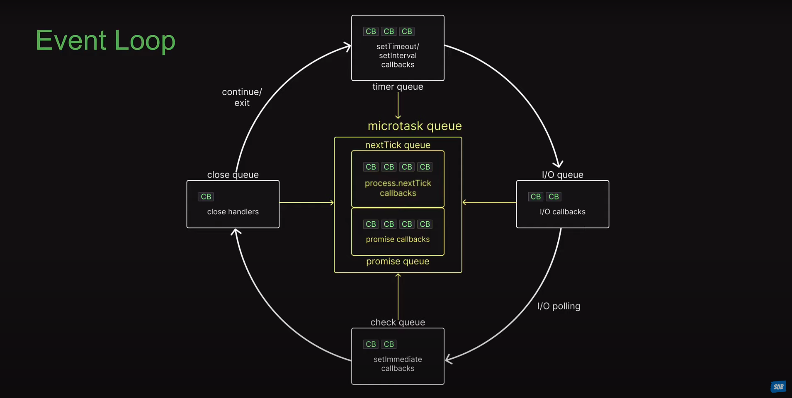

# Event Loop

The event loop is the core of the application. It is responsible for handling all the events that are triggered by the user or the system. It is also responsible for updating the UI and the state of the application.

## Event Loop - Visual Representation

## Event Loop - Execution Order

    * Any callback in the micro task queues are executed. First, tasks in the nextTick queue and only then tasks in the promise queue.
    * Any callback in the timers queue are executed.
    * Callback in the micro task queue if present are executed. Again, first tasks in the nextTick queue and then tasks in the promise queue
    * All callbacks within the I/O queue are executed
    * Callbacks in the micro task queues if present are executed. nextTick queue followed by the promise queue.
    * All callbacks in the check queue are executed.
    * Callbacks in the micro task queues if present are executed. Again, first tasks in the nextTick queue and then tasks in the promise queue
    * All callbacks in the close queue are executed.
    * For one final time in the same loop, the micro task queues are executed. The nextTick queue followed by the promise queue.

## Event Loop - Timers

The timers queue is the queue that handles all the timers. The timers are the functions that are executed after a certain amount of time. The timers are executed in the order they are scheduled. The timers are executed in the following order:

    * setTimeout
    * setInterval
    * setImmediate

## Event Loop - Micro Tasks

The micro task queue is the queue that handles all the micro tasks. The micro tasks are the tasks that are executed after the current execution stack is empty. The micro tasks are executed in the following order:

    * process.nextTick
    * Promise

## Event Loop - I/O

The I/O queue is the queue that handles all the I/O operations. The I/O operations are the operations that are executed after the current execution stack is empty. The I/O operations are executed in the following order:

    * fs
    * net
    * dns

## Event Loop - Check

The check queue is the queue that handles all the check operations. The check operations are the operations that are executed after the current execution stack is empty. The check operations are executed in the following order:

    * setImmediate

## Event Loop - Close

The close queue is the queue that handles all the close operations. The close operations are the operations that are executed after the current execution stack is empty. The close operations are executed in the following order:

    * close

## Event Loop - Timers Example

    * The first timer is scheduled to be executed after 1000ms. The second timer is scheduled to be executed after 2000ms. The third timer is scheduled to be executed after 3000ms.
    * The first timer is executed after 1000ms.
    * The second timer is executed after 2000ms.
    * The third timer is executed after 3000ms.

## Event Loop - Micro Tasks Example

    * The first micro task is scheduled to be executed after the current execution stack is empty. The second micro task is scheduled to be executed after the current execution stack is empty. The third micro task is scheduled to be executed after the current execution stack is empty.
    * The first micro task is executed after the current execution stack is empty.
    * The second micro task is executed after the current execution stack is empty.
    * The third micro task is executed after the current execution stack is empty.

## Event Loop - I/O Example

    * The first I/O operation is scheduled to be executed after the current execution stack is empty. The second I/O operation is scheduled to be executed after the current execution stack is empty. The third I/O operation is scheduled to be executed after the current execution stack is empty.
    * The first I/O operation is executed after the current execution stack is empty.
    * The second I/O operation is executed after the current execution stack is empty.
    * The third I/O operation is executed after the current execution stack is empty.

## Event Loop - Check Example

    * The first check operation is scheduled to be executed after the current execution stack is empty. The second check operation is scheduled to be executed after the current execution stack is empty. The third check operation is scheduled to be executed after the current execution stack is empty.
    * The first check operation is executed after the current execution stack is empty.
    * The second check operation is executed after the current execution stack is empty.
    * The third check operation is executed after the current execution stack is empty.

## Event Loop - Close Example

    * The first close operation is scheduled to be executed after the current execution stack is empty. The second close operation is scheduled to be executed after the current execution stack is empty. The third close operation is scheduled to be executed after the current execution stack is empty.
    * The first close operation is executed after the current execution stack is empty.
    * The second close operation is executed after the current execution stack is empty.
    * The third close operation is executed after the current execution stack is empty.

## Event Loop - Timers, Micro Tasks, I/O, Check and Close Example

    * The first timer is scheduled to be executed after 1000ms. The second timer is scheduled to be executed after 2000ms. The third timer is scheduled to be executed after 3000ms.
    * The first micro task is scheduled to be executed after the current execution stack is empty. The second micro task is scheduled to be executed after the current execution stack is empty. The third micro task is scheduled to be executed after the current execution stack is empty.
    * The first I/O operation is scheduled to be executed after the current execution stack is empty. The second I/O operation is scheduled to be executed after the current execution stack is empty. The third I/O operation is scheduled to be executed after the current execution stack is empty.
    * The first check operation is scheduled to be executed after the current execution stack is empty. The second check operation is scheduled to be executed after the current execution stack is empty. The third check operation is scheduled to be executed after the current execution stack is empty.
    * The first close operation is scheduled to be executed after the current execution stack is empty. The second close operation is scheduled to be executed after the current execution stack is empty. The third close operation is scheduled to be executed after the current execution stack is empty.
    * The first timer is executed after 1000ms.
    * The first micro task is executed after the current execution stack is empty.
    * The first I/O operation is executed after the current execution stack is empty.
    * The first check operation is executed after the current execution stack is empty.
    * The first close operation is executed after the current execution stack is empty.
    * The second timer is executed after 2000ms.
    * The second micro task is executed after the current execution stack is empty.
    * The second I/O operation is executed after the current execution stack is empty.
    * The second check operation is executed after the current execution stack is empty.
    * The second close operation is executed after the current execution stack is empty.
    * The third timer is executed after 3000ms.
    * The third micro task is executed after the current execution stack is empty.
    * The third I/O operation is executed after the current execution stack is empty.
    * The third check operation is executed after the current execution stack is empty.
    * The third close operation is executed after the current execution stack is empty.

## Authors

- [@muddusar-zulfiqar](https://github.com/MuddusarZulfiqar)
